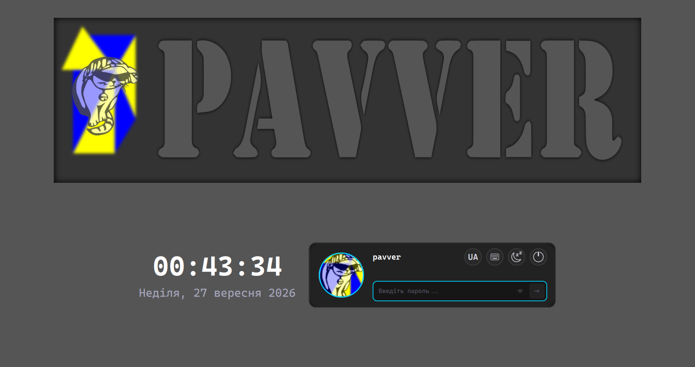
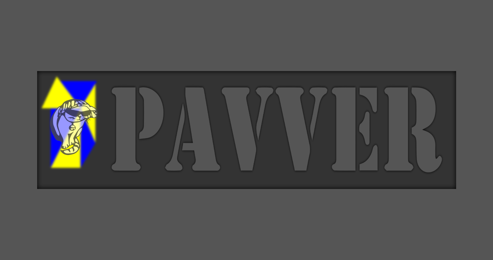

# Тема екрана блокування Pavver для Plasma

<div align="center">
  
  
  <p><em>Фірмова адаптивна тема екрана блокування для <b>KDE Plasma 6</b> з динамічним режимом скрінсейвера, плавною кінематикою, типографікою Cascadia Code та тактильним зворотним зв'язком.</em></p>
</div>

---

## ✨ Особливості

- **🌌 Інтерактивний режим скрінсейвера**:
  - **Автоматична активація**: вмикається одразу при блокуванні системи, а також після 20 секунд простою (якщо поле вводу пароля порожнє).
  - **Фокус на геометрії та анімації**: годинник і картка вводу плавно ховаються вниз за межі екрана (`y = height + 70`, `opacity: 0.0`), курсор приховується.
  - **Центрування та пропорційне масштабування**: фірмовий прямокутний банер з котиком та анімованими трикутниками плавно переміщується точно в центр екрана, займаючи 85% ширини дисплея зі збереженням співвідношення `675:190`.
  - **Захист від випадкового пробудження**: після переходу в скрінсейвер діє таймер затримки (2.5 с), який запобігає миттєвому зриву анімації від випадкового дотику до миші чи відпускання клавіш.

- **⚡ Плавний вихід із режиму скрінсейвера**:
  - Будь-який рух мишкою, клік або натискання будь-якої клавіші активує режим розблокування.
  - Перша клавіша лише вимикає скрінсейвер і не передається прихованому полю пароля.
  - Синхронізована 550мс кінематика (`Easing.OutCubic`): банер плавно повертається у верхню частину екрана, годинник і картка піднімаються знизу на свої позиції, а поле пароля автоматично отримує фокус для подальшого введення без миші.

- **🎨 100% відповідність дизайн-системі SDDM**:
  - Точна піксельна відповідність темі входу [`pavver-sddm-theme`](https://github.com/pavver/pavver-sddm-theme).
  - Великі круглі кнопки дій `48 x 48 px` (Сон, Перезавантаження, Вимкнення) з векторними іконками `32 x 32 px` та фірмовими неоновими акцентами.
  - Чіткий перемикач розкладки клавіатури з великим шрифтом Cascadia Code `24 px` напівжирного накреслення.
  - Круглий аватар користувача з неоновим бірюзовим контуром та автоматичним завантаженням системного фото з AccountsService.

- **📱 Адаптація до маленьких екранів (640×480 VGA / безпечний режим)**:
  - На компактних екранах (висота < 520 або ширина < 750), де в стандартному режимі банер приховується для економії місця, у режимі скрінсейвера він відображається по центру.
  - При виході зі скрінсейвера банер плавно виїжджає вгору за верхній край екрана (`y = -bannerHeight - 40`) із паралельним згасанням.

- **🔒 Оптимізовано спеціально для екрана блокування**:
  - Нативна інтеграція з API **Plasma 6 / kscreenlocker** (`authenticator.respond()`, `authenticator.startAuthenticating()`).
  - Повні системні дії (Сон, Перезавантаження, Вимкнення) через нативний `SessionManagement`.
  - Вбудована компактна віртуальна клавіатура з EN/UA розкладками, яку можна переміщувати та змінювати за розміром.

- **💡 Тактильний фідбек автентифікації**:
  - **Успішне розблокування**: неоново-зелена пульсація контуру поля введення (`#00e676`) та завершення після короткої 500мс анімації.
  - **Помилка пароля**: повторне надсилання тимчасово блокується, а через дві секунди поле очищується та знову отримує фокус.

- **⚠ Індикатор Caps Lock**:
  - Висококонтрастний бейдж `[ ⚠ CAPS ]` із золотистим підсвічуванням розміщено ліворуч всередині поля введення пароля, акуратно зміщуючи текст праворуч при активації.

- **📦 100% автономність**:
  - Жодних зовнішніх мережевих запитів, CDN або сторонніх залежностей.
  - Векторні SVG та шрифт Cascadia Code вбудовані безпосередньо в пакет теми.

---

## 🚀 Встановлення

### Автоматичне встановлення

Клонуйте репозиторій та запустіть скрипт встановлення:

```bash
git clone https://github.com/pavver/pavver-kde6-themes.git
cd pavver-kde6-themes/lockscreen
./install.sh
```

> **Порада**: запускайте інсталятор без `sudo`, щоб встановити тему для поточного користувача у `~/.local/share/plasma/shells/pavver-plasma-lockscreen`. Запуск через `sudo ./install.sh` встановлює пакет системно у `/usr/share/plasma/shells/pavver-plasma-lockscreen`, але активувати його потрібно в конфігурації потрібного користувача.

Скрипт автоматично:
1. Встановить мінімальний пакет `Plasma/Shell`, який замінює екран блокування.
2. Встановить права доступу `755` для каталогів і `644` для файлів.
3. Активує пакет через `plasmashellrc → [Shell] ShellPackage`.
4. Перед копіюванням перевірить метадані, прев'ю, QML-імпорти та структуру KPackage.

---

### Ручне встановлення

1. З кореня репозиторію зберіть автономний пакет:

   ```bash
   ./scripts/build.sh
   ```

2. Встановіть його штатним KPackage-інструментом і активуйте:

   ```bash
   kpackagetool6 --type Plasma/Shell --install \
       dist/themes/lockscreen/pavver-plasma-lockscreen
   kwriteconfig6 --file plasmashellrc --group Shell \
       --key ShellPackage pavver-plasma-lockscreen --notify
   ```

Не копіюйте вихідний каталог `contents` напряму: він містить симлінк для розробки, тоді як `dist/` завжди містить автономну фізичну копію спільного модуля.

Окремий екран блокування у Plasma 6.7 завантажується з пакета оболонки, тому ця тема не з'являється як самостійний пункт глобальної теми (Look-and-Feel) у Системних параметрах.

---

## 🔍 Тестування теми наживо

Ви можете протестувати екран блокування без блокування робочого сеансу за допомогою вбудованої утиліти KDE:

```bash
/usr/lib/kscreenlocker_greet --testing --shell pavver-plasma-lockscreen
```

Для візуальної перевірки панелі безпарольного входу та приховування недоступних системних дій запустіть автономне демо:

```bash
qml6 demo/Preview.qml
```

У звичайному демо пароль `error` імітує невдалу автентифікацію, а будь-який інший пароль — успішну. Для окремої перевірки панелі безпарольного входу:

```bash
qml6 demo/PasswordlessPreview.qml
```

У демо доступні сон і вимкнення, а недоступна дія перезавантаження прихована. Натискання «Розблокувати» лише показує тестове підтвердження і не завершує демо.

---

## 📂 Структура проєкту

```
pavver-plasma-lockscreen/
├── metadata.json                 # Декларація мінімального пакета Plasma/Shell
├── install.sh                    # Інсталятор і активація через plasmashellrc
├── demo/Preview.qml              # Автономне прев’ю пароля та віртуальної клавіатури
├── demo/PasswordlessPreview.qml  # Автономне прев’ю панелі безпарольного входу
├── preview.png                   # Основне прев'ю теми
├── preview_unlock.png            # Знімок екрана в режимі розблокування
├── preview_screensaver.png       # Знімок екрана в режимі скрінсейвера
├── preview_capslock.png          # Знімок екрана з активним індикатором Caps Lock
├── contents/
│   └── lockscreen/
│       ├── LockScreen.qml        # Точка входу kscreenlocker
│       ├── LockScreenUi.qml      # Машина станів скрінсейвера та кінематика переходів
│       ├── LockScreenBackend.qml # Адаптер authenticator/SessionManagement
│       └── PavverTheme -> ../../../shared/PavverTheme
```

Інсталятор розгортає симлінк як автономний QML-модуль. Кольори, шрифти,
геометрія та анімації налаштовуються у
`../shared/PavverTheme/Theme.qml`.

---

## 📄 Ліцензія

Цей проєкт розповсюджується під ліцензією [GPL-3.0-or-later](LICENSE).
