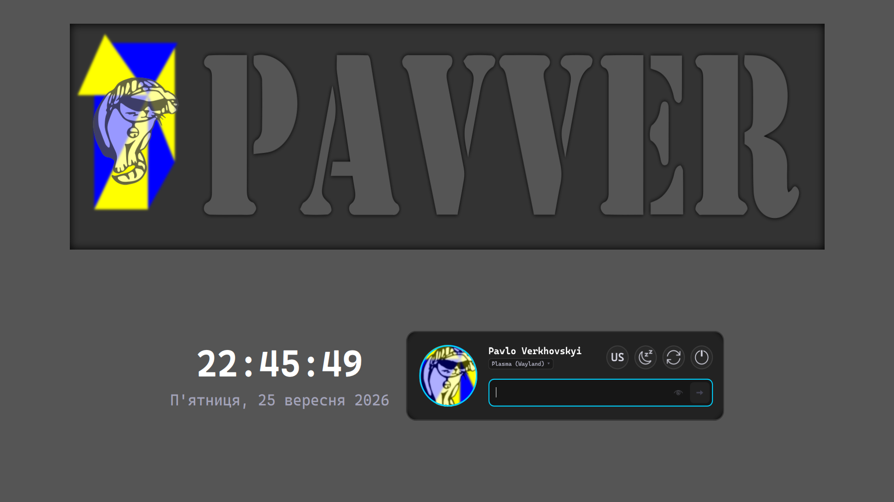

# Тема Pavver для SDDM

<div align="center">
  
  <p><em>Сучасна, самостійна та адаптивна тема для SDDM (Qt 6) з анімацією, типографікою Cascadia Code та тактильним зворотним зв'язком.</em></p>
</div>

---

## ✨ Особливості

- **📐 Адаптивна система компонування**:
  - **Full HD (1920×1080) та вище (2K, 4K, надширокі 21:9)**: величний верхній банер (~47% висоти) та повнорозмірні компоненти.
  - **Широкоформатні дисплеї (21:9)**: висота банера захищена від перерозтягування стелею у 45% висоти екрана, тому інтерфейс ніколи не виштовхується вниз.
  - **Ноутбуки та планшети (1366×768, 1280×800, 1024×768)**: плавне пропорційне масштабування годинника та картки без обрізання.
  - **Компактні екрани / безпечний режим (640×480 VGA)**: банер і годинник автоматично приховуються, а картка входу ідеально центрується по центру екрана.
- **🕒 Чіткий векторний годинник**:
  - Нативний рендеринг шрифту через векторний рушій Qt з субпіксельним згладжуванням (`Text.QtRendering`).
  - Відображення поточної дати українською мовою.
- **💡 Тактильний зворотний зв'язок (пульсація рамки)**:
  - **Успішний вхід**: неоново-зелена пульсація рамки (`#00e676`) з плавним переходом на екран завантаження (кіт-лоадер).
  - **Помилка входу**: пароль миттєво очищується та знову приховується, повторне надсилання тимчасово блокується, рамка пульсує червоним і з’являється коротке статусне повідомлення.
- **⚠ Помітний індикатор Caps Lock**:
  - Висококонтрастний попереджувальний бейдж `[ ⚠ CAPS ]` із золотим підсвічуванням та спливаючою підказкою.
- **🖥 Вбудований селектор робочих середовищ (DE)**:
  - Можливість вибору будь-якого доступного сеансу (Plasma Wayland, Plasma X11, GNOME, Hyprland тощо) безпосередньо у картці користувача.
- **👤 Ручне введення користувача**:
  - Пункт «Інший користувач...» доступний у селекторі та автоматично вмикається, якщо SDDM приховує список облікових записів.
- **⌨ Вбудована віртуальна клавіатура**:
  - Самодостатня плаваюча EN/UA клавіатура для імені користувача та пароля, яку можна переміщувати й змінювати за розміром.
  - Escape послідовно закриває селектори та клавіатуру, а клік поза відкритим селектором закриває його.
- **🌙 Скрінсейвер під час бездіяльності**:
  - Після 60 секунд бездіяльності форма входу та годинник ховаються, а анімований банер переходить у великий центральний режим.
  - Рух миші, клік або клавіша повертають форму входу; таймер не спрацьовує під час введення, роботи з меню чи екранною клавіатурою.
- **⏳ Індикатор запуску сеансу**:
  - Після надсилання форми відображається спільна анімація завантаження.
  - При помилці SDDM повертає форму, а після успіху індикатор залишається до закриття екрана входу під час запуску сесії.
- **📦 100% автономність**:
  - Жодних зовнішніх мережевих запитів або CDN.
  - Шрифт Cascadia Code та всі SVG-вектори постачаються локально всередині теми.
  - Використовуються лише QML-модулі зі стандартного набору KDE Plasma 6.

---

## 🚀 Встановлення

### Системні вимоги

- SDDM, зібраний із Qt 6 (`sddm-greeter-qt6`).
- KDE Plasma 6 / `plasma-workspace`.
- QML-модулі `QtQuick`, `QtQuick.Controls`, `QtQuick.Shapes`, `Qt5Compat.GraphicalEffects`, `org.kde.kirigami` та `org.kde.plasma.private.keyboardindicator`.

У повній інсталяції Plasma 6 ці модулі постачаються пакетами Plasma Workspace, Qt 6 Declarative, Qt 6 5Compat і Kirigami. На мінімальних інсталяціях назви пакетів залежать від дистрибутива; для Arch Linux вони є прямими залежностями `plasma-workspace`.

### Автоматичне встановлення (рекомендовано)

Клонуйте репозиторій та запустіть скрипт встановлення:

```bash
git clone https://github.com/pavver/pavver-kde6-themes.git
cd pavver-kde6-themes/sddm
sudo ./install.sh
```

Скрипт є сумісною обгорткою спільного інсталятора. Він:

1. Збере всі три автономні артефакти та виконає перевірки метаданих, прев'ю, QML та KPackage.
2. Вкладе фізичну копію `PavverTheme` і атомарно встановить SDDM-тему в `/usr/share/sddm/themes/pavver-sddm-theme`.
3. Встановить права `755` для каталогів і `644` для файлів.
4. Явно активує SDDM через власний `/etc/sddm.conf.d/zz-pavver-theme.conf`.
5. Не редагуватиме `/etc/sddm.conf`; якщо той має власний `Theme/Current`, інсталятор попередить про можливе перевизначення.

---

### Ручне встановлення

1. Скопіюйте каталог теми до системної директорії SDDM:
   ```bash
   sudo install -d -m 755 /usr/share/sddm/themes/pavver-sddm-theme
   sudo cp -RL Main.qml SddmBackend.qml metadata.desktop theme.conf preview.png PavverTheme /usr/share/sddm/themes/pavver-sddm-theme/
   sudo find /usr/share/sddm/themes/pavver-sddm-theme -type d -exec chmod 755 {} +
   sudo find /usr/share/sddm/themes/pavver-sddm-theme -type f -exec chmod 644 {} +
   ```

2. Увімкніть тему в конфігурації SDDM:
   Відкрийте `/etc/sddm.conf.d/zz-pavver-theme.conf` (або створіть його) і додайте секцію:
   ```ini
   [Theme]
   Current=pavver-sddm-theme
   ```

---

## 🔍 Тестування теми без перезавантаження

Ви можете перевірити тему в тестовому вікні SDDM прямо з термінала:

```bash
sddm-greeter-qt6 --test-mode --theme /usr/share/sddm/themes/pavver-sddm-theme
```

Або перед встановленням з директорії репозиторію:

```bash
sddm-greeter-qt6 --test-mode --theme .
```

Швидке демонстраційне прев’ю вмикає скрінсейвер після 2 секунд бездіяльності:

```bash
qml6 demo/Preview.qml
```

---

## 📂 Структура проєкту

```
pavver-sddm-theme/
├── Main.qml                  # Композиція SDDM та адаптивна геометрія
├── SddmBackend.qml           # Адаптер sddm/userModel/sessionModel/keyboard
├── demo/Preview.qml          # Демонстраційний тест скрінсейвера без SDDM
├── PavverTheme -> ../shared/PavverTheme # Спільний інтерфейс під час розробки
├── metadata.desktop          # Метадані теми SDDM (Theme-API=2.0, QtVersion=6)
├── theme.conf                # Конфігурація кольорів та шрифтів
├── preview.png               # Скріншот теми для системних налаштувань KDE
└── install.sh                # Розгортає симлінк в автономний QML-модуль
```

Кольори, шрифти, геометрія та анімації налаштовуються у `../shared/PavverTheme/Theme.qml`.

---

## 📄 Ліцензія

Цей проєкт поширюється за ліцензією [GPL-3.0-or-later](LICENSE).
